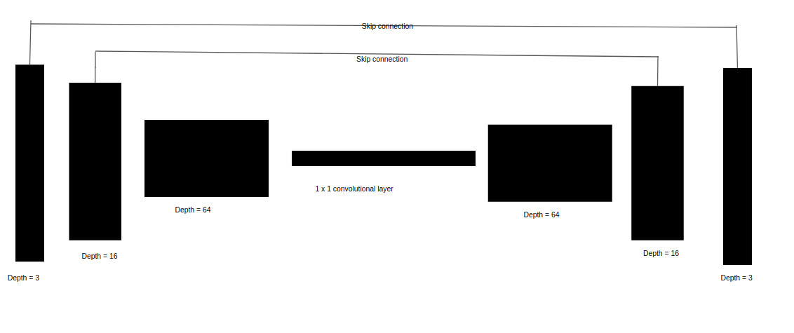
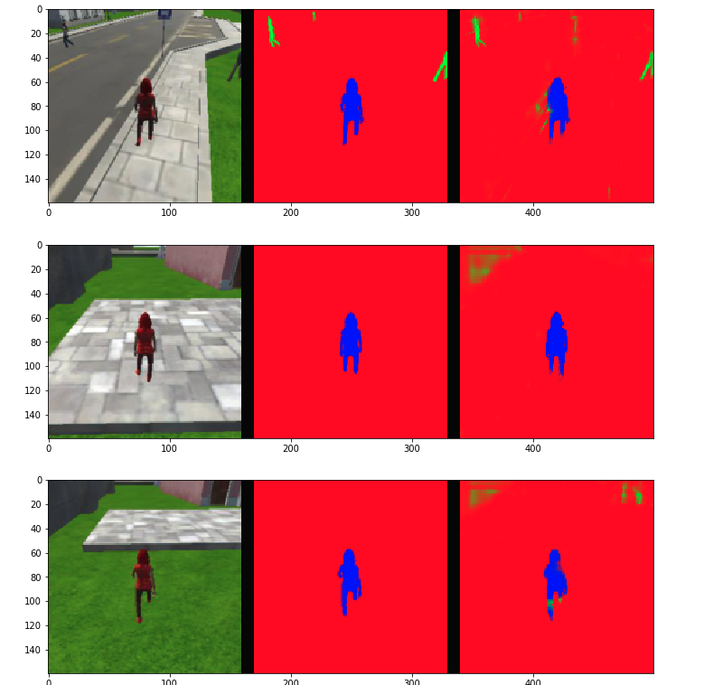
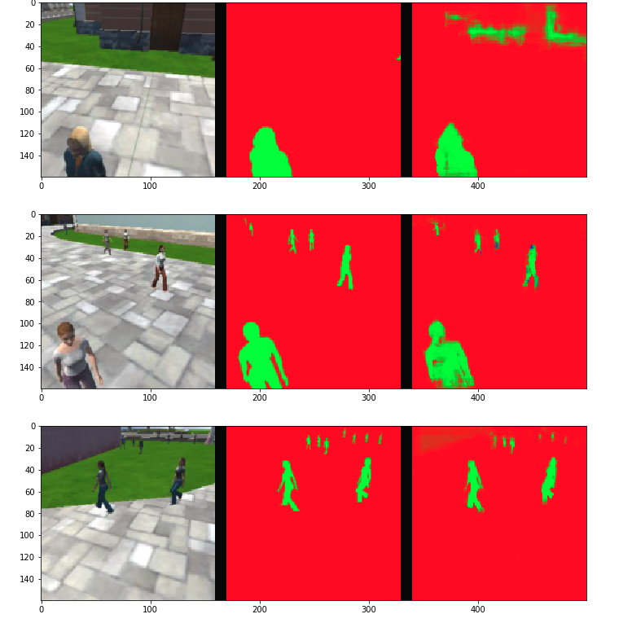
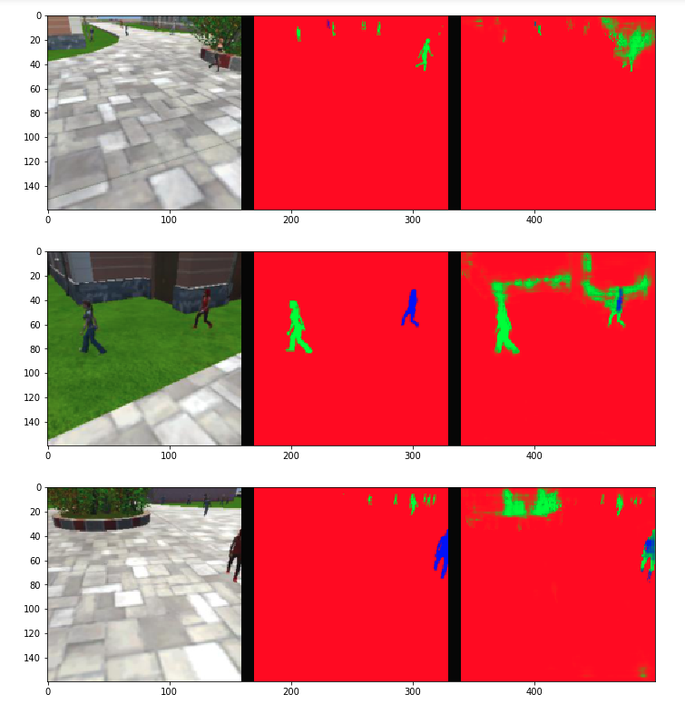

## Deep Learning Project

The goal of this project is to build and train a Fully convolution Neural Netwok(FCN) to identify a specific person among people. then the quadrotor continues to follow it.

FCNs works with three main advantages:
- It replaces fully connected layers with 1x1 convolution layers to store spational information
- Upsampling through the use of transposed convolutional layers
- Skip connections to perserve lost information during convolution


###  Network Architecture

The network architecture is composed of following layers

- 2 encoder layers
- 1x1 conv layer
-  2 decoder layers
  
Below shows the architechture:



### Model Information

Building the Model

##### The Encoder Block

The encoder block includes a separable convolution layer using the separable_conv2d_batchnorm() function:

```python
def encoder_block(input_layer, filters, strides):
    
    # TODO Create a separable convolution layer using the separable_conv2d_batchnorm() function.
    output_layer = separable_conv2d_batchnorm(input_layer, filters, strides=strides)
    return output_layer
```

as is shown above, the input image size is (160, 160, 3),the Encoder will essentially require separable convolution layers, Separable convolutions, also known as depthwise separable convolutions, comprise of a convolution performed over each channel of an input layer and followed by a 1x1 convolution that takes the output channels from the previous step and then combines them into an output layer.

    def separable_conv2d_batchnorm(input_layer, filters, strides=1):
            output_layer = SeparableConv2DKeras(filters=filters,kernel_size=3, strides=strides,
                                     padding='same', activation='relu')(input_layer)
            output_layer = layers.BatchNormalization()(output_layer) 
            return output_layer
            
The reduction in the parameters make separable convolutions quite efficient with improved runtime performance and are also, as a result, useful for mobile applications. They also have the added benefit of reducing overfitting to an extent, because of the fewer parameters.

Also the separable_conv2d_batchnorm() function adds a batch normalization layer after the separable convolution layer, this is beacuse the batchnorm() has some advantages list below:

- Networks train faster – Each training iteration will actually be slower because of the extra calculations during the forward pass. However, it should converge much more quickly, so training should be faster overall.
- Allows higher learning rates – Gradient descent usually requires small learning rates for the network to converge. And as networks get deeper, their gradients get smaller during back propagation so they require even more iterations. Using batch normalization allows us to use much higher learning rates, which further increases the speed at which networks train.
- Simplifies the creation of deeper networks – Because of the above reasons, it is easier to build and faster to train deeper neural networks when using batch normalization.
- Provides a bit of regularization – Batch normalization adds a little noise to your network. In some cases, such as in Inception modules, batch normalization has been shown to work as well as dropout.

there are two encode layers,each encoding layer performs a depthwise separable convolution. This requires less compute resources as opposed to using normal convolutions. It is able to accomplish this by significantly reducing the total number of parameters necessary for the computations.

##### Decoder Block

``` python
def decoder_block(small_ip_layer, large_ip_layer, filters):
   
    # Upsample the small input layer using the bilinear_upsample() function.
    upsampled_small_ip_layer = bilinear_upsample(small_ip_layer)
    
    # Concatenate the upsampled and large input layers using layers.concatenate
    concatenated = layers.concatenate([upsampled_small_ip_layer, large_ip_layer])
    # Add some number of separable convolution layers
    conv_layer_1 = separable_conv2d_batchnorm(concatenated, filters)
    conv_layer_2 = separable_conv2d_batchnorm(conv_layer_1, filters)
    output_layer = separable_conv2d_batchnorm(conv_layer_2, filters)
    
    return output_layer
```
The decoder block is comprised of three parts:
- A bilinear upsampling layer using the upsample_bilinear() function. The current recommended factor for upsampling is set to 2.
- A layer concatenation step. This step is similar to skip connections. You will concatenate the upsampled small_ip_layer and the large_ip_layer.
- Some (one or two) additional separable convolution layers to extract some more spatial information from prior layers.

Bilinear upsampling is a resampling technique that utilizes the weighted average of four nearest known pixels, located diagonally to a given pixel, to estimate a new pixel intensity value. The weighted average is usually distance dependent.The bilinear upsampling method does not contribute as a learnable layer like the transposed convolutions in the architecture and is prone to lose some finer details, but it helps speed up performance.
One added advantage of concatenating the layers is that it offers a bit of flexibility because the depth of the input layers need not match up unlike when you have to add them. Which helps simplify the implementation as well.

Concatenating two layers, the upsampled layer and a layer with more spatial information than the upsampled one,While layer concatenation in itself is helpful for your model, it can often be better to add some regular or separable convolution layers after this step for your model to be able to learn those finer spatial details from the previous layers better.

#####  1X1 convolution
- In 1x1 convolution the tensor remains 4D instead of getting flattened to 2D. Hence the spatial information is preserved.
- A 1x1 convolution is essentially convolving with a set of filters of dimensions:
- 1x1xfilter_size (HxWxD), stride = 1, same padding.

##### Transposed convolution
It is reverse convolution where foward and backward passed are swapped.the decoding layers after this 1x1 layer are later on used to ensure that spatial information is preserved, and that the final output shows where each object is located in the image.

#####  Skip Connections
The global information is lost in encoder blocks as we look at patches. Skip connection helps to retain that information. The output of one layer is connected to non-adjacent layer.

##### Full Model\

After finish previous steps, we add them all together to train the model:
``` python
def fcn_model(inputs, num_classes):
    
    # TODO Add Encoder Blocks. 
    encoder_block1 = encoder_block(inputs, 16, strides=2)
    encoder_block2 = encoder_block(encoder_block1,64, strides=2)
    # TODO Add 1x1 Convolution layer using conv2d_batchnorm().
    one_by_one_conv = conv2d_batchnorm(encoder_block2, 256, kernel_size=1, strides=1)

    # TODO: Add the same number of Decoder Blocks as the number of Encoder Blocks
    decoder_block1 = decoder_block(one_by_one_conv, encoder_block1, 64)
    x = decoder_block(decoder_block1, inputs, 16)
    
    return layers.Conv2D(num_classes, 1, activation='softmax', padding='same')(x)
```

### Network Parameters

learning_rate = 0.01
batch_size = 40
num_epochs = 20
steps_per_epoch = 200
validation_steps = 50
workers = 2

- learning_rate

The learning rate is a value shows how fast a neural network makes adjustments to what it has learned while it is being trained.The ideal learning rate would allow a neural network to reach the gradient descent and error minimization minimums at the least amount of time, without causing overfitting.
The learning rate 0.01 is used by the defaut of the project, I also tried 0.005 and 0.001, due to the trainning process is too slow,I trained on my ubuntu 16.04 with gpu 1070, the 0.01 fits for the project requiments.

- batch_size

The batch size is the number of images that are processed together as a batch for every step of the epoch or the training period. So in this instance, for every step of training, 40 images are taken from the training set and are used for the gradient descent step to minimize the error or loss value.A good batch size would be one that is large enough such that it can still be handled by available computing resources, but at the same time not too large to cause overfitting. It should also be small enough but not too small. If the batches are too small, the neural network may have difficulty forming its generalizations.

- num_epochs

An epoch is a single forward and backward pass of the whole dataset. This is used to increase the accuracy of the model without requiring more data.Each epoch attempts to move to a lower cost, leading to better accuracy. this is flexiable value to be set up with, due to my previouse experience with deep learning project. 20 is relative reasonable number to start with, so I used 20 with good result to pass the test.

- steps_per_epoch

steps_per_epoch: Total number of steps (batches of samples) to yield from generator before declaring one epoch finished and starting the next epoch. It should typically be equal to the number of unique samples of your dataset divided by the batch size.


- validation_steps

similar to steps_per_epoch but on the validation data set instead on the training data.
This is also the default value provided by the project.

- workers

max number of used processes
This is also the default value provided by the project.


### Results and Discussion
Now lets look at your predictions, and compare them to the ground truth labels and original images. 
patrol_with_targ: Test how well the network can detect the hero from a distance.

patrol_non_targ: Test how often the network makes a mistake and identifies the wrong person as the target.

following_images: Test how well the network can identify the target while following them.

- images while following the target


- images while at patrol without target


- images while at patrol with target


- Scores for while the quad is following behind the target. 

        number of validation samples intersection over the union evaulated on 542
        average intersection over union for background is 0.9899375885213009
        average intersection over union for other people is 0.25547930171195143
        average intersection over union for the hero is 0.8132220120343139
        number true positives: 528, number false positives: 0, number false negatives: 11

- Scores for images while the quad is on patrol and the target is not visable

        number of validation samples intersection over the union evaulated on 270
        average intersection over union for background is 0.96647913901211
        average intersection over union for other people is 0.6293791756770767
        average intersection over union for the hero is 0.0
        number true positives: 0, number false positives: 31, number false negatives: 0

- This score measures how well the neural network can detect the target from far away

        number of validation samples intersection over the union evaulated on 322
        average intersection over union for background is 0.9824235094965825
        average intersection over union for other people is 0.2831436550714913
        average intersection over union for the hero is 0.2679280334937


    number true positives: 149, number false positives: 0, number false negatives: 152

    Sum all the true positives, etc from the three datasets to get a weight for the score = 0.7772675086107922

    The IoU for the dataset that never includes the hero is excluded from grading
    = final_IoU = (iou1 + iou3)/2 = 0.5405750227640069

    The final grade score is 
    = final_score = final_IoU * weight = 0.42017140116100193
    
    
Training and validation data are all used based in the project, and I didn't additonal images or any other image pre-processing for the project, even though the test is passed, but there are still more things can be imporved, 
the data sets is only based on provided, so probrobly it can't be genralized very well when switch people, this networks can be used to train different data sets to improve the result of roboustness. Aso the parameters in this project can also be improved with more training variation due to the time limit.
